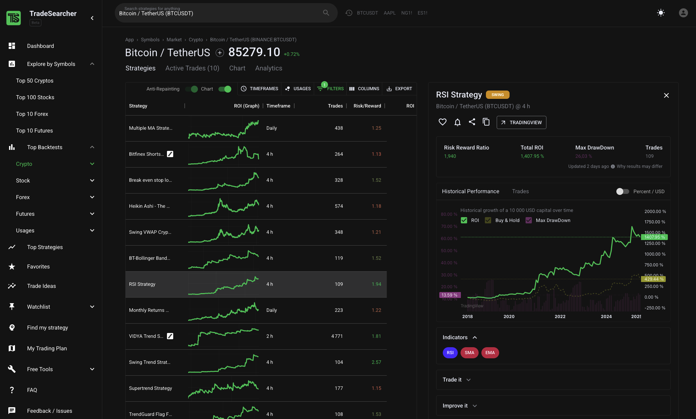

# TradeSearcher

A TradingView strategy finder and mass backtester to discover optimal strategies for manual and automated trading.

## Key Features

| Category              | Highlights                                                                                                                                       |
| --------------------- | ------------------------------------------------------------------------------------------------------------------------------------------------ |
| Automated Backtesting | • Save hundreds of hours of testing by automatically fetching strategies and backtesting them against 200+ symbols (crypto/stocks/futures/forex) |
| UI & Results Display  | • Display all results in an UI with: Performance (ROI, Sharpe, Equity Graph), Past Trades                                                        |
| Search Engine         | • Query by market (crypto, stocks, forex) • Filter by timeframe, symbol, strategy type (scalping, AI…) • Sort by ROI, Risk / Reward, trade count |
| Strategy Pages        | • Full backtest stats, equity curve, settings, TradingView link, copy‑paste webhook alerts                                                       |
| AI Code Explaining    | • Understand how winning strategies works and learn from them                                                                                    |
| Live Scanner          | • Streams the freshest ideas from the entire dataset every few minutes                                                                           |
| Free Tools            | • Profit calculator, Monte‑Carlo simulator, Risk‑of‑Ruin, Kelly, Lot‑size & more                                                                 |
| Premium               | • Access backtests with a Risk/Reward Ratio > 3, Real‑time data (IEX), auto‑updated Top 10 list, unlimited filters, priority support             |

## Technical Stack

Languages: TypeScript (Next.js), PostgreSQL, Node & Python 3.11

APIs & Data: TradingView public snapshots, IEX Cloud, crypto aggregated feeds

AI stack: LLMs integration for code-explaining of scripts

Storage: Postgres (Timescale) + S3 object archive

Infra: Infomaniak, CloudFront CDN, auto‑scaling worker pool

Monitoring: Open‑Telemetry, Grafana, Sentry

## Key Figures (Live Version)

100 000+ profitable TradingView backtests in one place – save hundreds of hours of research.

AI‑powered code explaining to learn from top strategies.

Data you can trust: ROI, Risk‑Reward, total trades, Sharpe & more, updated daily.

Actionable today: real‑time scanner highlights ideas published within the last 24 h.

Loved by 3 200+ traders since beta launch (Feb 2024).

## Quick Start

Sign‑up at tradesearcher.ai

Use the search bar to filter strategies by symbol (e.g. BTCUSDT, AAPL) or use reverse-search (search strategies).

Click any result to open the strategy dashboard and review performance.

Connect your TradingView alerts or export CSV for deeper analysis.

Tip: Save your filters as bookmarks and favorites strategies

## Roadmap

✅ Popular Strategies Fetching

✅ Automatic Backtesting on Top 200 symbols and 4 markets (stocks, futures, crypto, index)

✅ Repainting detection with replay

✅ Filtering, Columns

✅ Last Trades & Performance Visualization

✅ Live scanner for ideas < 24 h

✅ SuperTrend native integration

🔜 Chrome Extension (Automatic strategies retrieval & Add to chart)

🔜 Improved Repainting Detection

🔜 Mobile‑first progressive web‑app

## License

TradeSearcher is a closed‑source, commercial SaaS.This repository hosts only public documentation—no application code is shared.

© 2024‑2025 TradeSearcher Ltd. All rights reserved.

## Community & Support

Discord/Email: On Website

Twitter/X: @TradeSearcher\_
